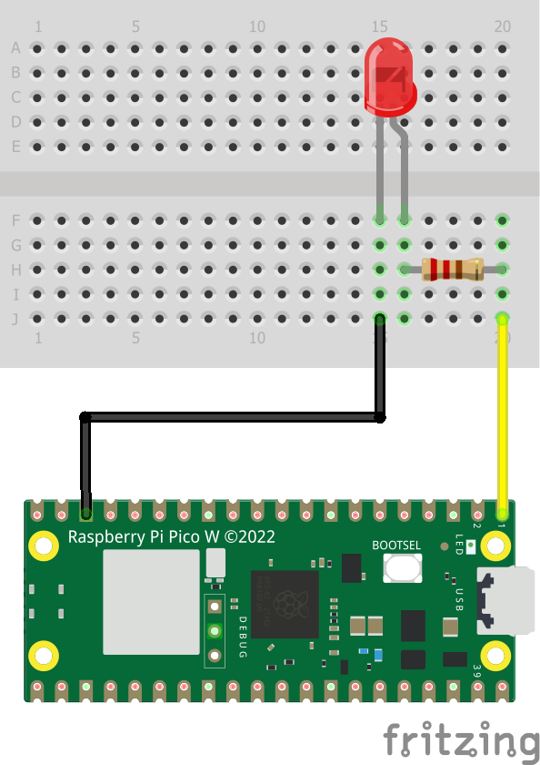

# DIY 1: Blinky and Button

Now, you will create a project from scratch making use of a [project template for the `rp2040-hal`](https://github.com/rp-rs/rp2040-project-template)

## Hardware Setup



## Project Initialisation

```sh
cargo generate https://github.com/rp-rs/rp2040-project-template
```

In `.cargo/config.toml` use `runner = "elf2uf2-rs -d"`.

## Code

In `main.rs` use `let mut led_pin = pins.gpio0.into_push_pull_output();`

## Run

Press *BOOTSEL* on Raspberry Pi Pico WH while plugging the USB cable to your computer. Release the button and run

```sh
cargo run
```

## Hands On!

- Connect a button to your RPi.
- Adapt the project such, that you can switch on/off the LED using the button.
